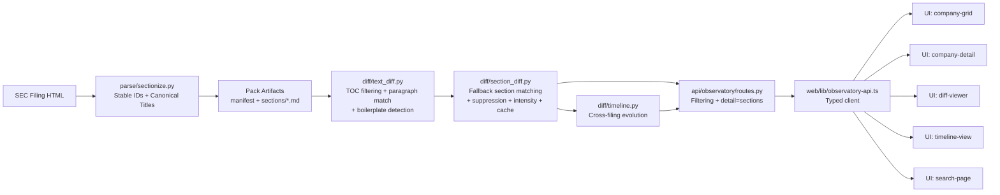

# Observatory System Map

A module-by-module view of how a filing becomes a diff, a timeline, and a search result. Use this when onboarding to the Observatory pipeline or when tracing an unexpected output back to its source.

## Design goals

- Flow first, details second.
- Each module is traceable back to a file path and a test.
- Layered: 90-second overview, 10-minute mental model, deep-debug mode.

## Module map

## Layered drill-down plan

### Layer 1: 90-second orientation

- Data enters at `sectionize`.
- Diff intelligence happens in `text_diff` + `section_diff`.
- API shapes payloads for summary vs deep views.
- UI consumes typed models and surfaces ranking/filters.

### Layer 2: 10-minute implementation mental model

- `text_diff`: filter TOC links, match paragraphs by fingerprint then Jaccard similarity, detect boilerplate via cross-reference patterns and ratio-based token checks.
- `section_diff`: three-pass section matching (exact ID, fallback by item+slug, genuinely new/removed), suppress financial and signature sections, strip boilerplate from output, compute intensity and `interest_score`, cache by manifest-pair hash.
- `routes`: serve lightweight (`detail=sections`) or full payloads.

### Layer 3: deep-debug mode

- Why a section ranked high: inspect paragraph deltas and score factors.
- Why intensity dropped: inspect similarity weighting + boilerplate exclusion.
- Why a section is missing: check if its `section_type` is in the suppression list (financial_statement, signature).
- Why two filings show 0 added/removed despite Part changes: fallback matching paired them by item+slug.
- Why response is fast: verify cache-hit path and stripped payload mode.

## Interaction pattern for an interactive version

- Hover module: one-sentence purpose + key outputs.
- Click module: code pointers, invariants, and tests.
- Toggle overlays:
  - `Signal vs Noise` (boilerplate, financial statements, signatures)
  - `Performance` (cache hit/miss, payload sizes)
  - `Traceability` (input -> output fields)

## Avoiding “garbled complexity”

- Keep every card to: `Purpose`, `Inputs`, `Outputs`, `Invariants`.
- Never show more than one abstraction level in a single frame.
- Use one canonical example (NVDA 10-K year-over-year) across all layers.
- Color semantics:
  - blue = core pipeline
  - amber = scoring/ranking
  - green = performance paths
  - gray = suppressed pathways (financials, signatures, boilerplate)
