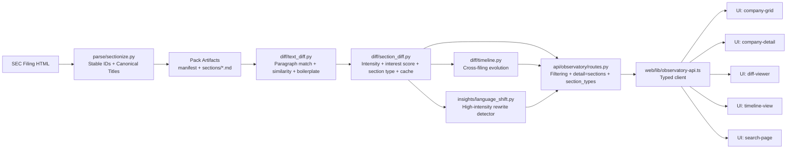

# Observatory Visual Explainer Blueprint

This is a narrative-first system map for onboarding engineers quickly without sacrificing depth.

## Design goals

- Show **flow** before details.
- Make each module clickable in an interactive version.
- Layer complexity (overview -> implementation -> edge cases).
- Preserve rigor while keeping visual language approachable.

## Module map

## Layered drill-down plan

### Layer 1: 90-second orientation

- Data enters at `sectionize`.
- Diff intelligence happens in `text_diff` + `section_diff`.
- API shapes payloads for summary vs deep views.
- UI consumes typed models and surfaces ranking/filters.

### Layer 2: 10-minute implementation mental model

- `text_diff`: match paragraphs, compute similarity, tag boilerplate.
- `section_diff`: compute intensity and `interest_score`, classify section type, cache by manifest-pair hash.
- `routes`: serve lightweight (`detail=sections`) or full payloads; filter by section type.

### Layer 3: deep-debug mode

- Why a section ranked high: inspect paragraph deltas and score factors.
- Why intensity dropped: inspect similarity weighting + boilerplate exclusion.
- Why response is fast: verify cache-hit path and stripped payload mode.

## Interaction pattern for an interactive version

- Hover module: one-sentence purpose + key outputs.
- Click module: code pointers, invariants, and tests.
- Toggle overlays:
  - `Signal vs Noise` (boilerplate, financial statements, signatures)
  - `Performance` (cache hit/miss, payload sizes)
  - `Traceability` (input -> output fields)

## Avoiding “garbled complexity”

- Keep every card to: `Purpose`, `Inputs`, `Outputs`, `Invariants`.
- Never show more than one abstraction level in a single frame.
- Use one canonical example (NVDA 10-K year-over-year) across all layers.
- Color semantics:
  - blue = core pipeline
  - amber = scoring/ranking
  - green = performance paths
  - gray = expected-noise pathways
