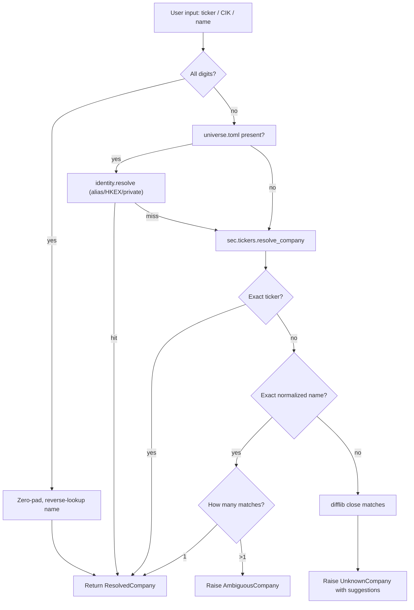

# Company name resolution

Broaden EdgarPack CLI input so any company name (e.g. `"Apple Inc"`, `"NVIDIA"`, `"nvidia"`) resolves automatically to a ticker/CIK, matching against the full SEC `company_tickers.json` universe plus local `universe.toml` aliases. Same error ergonomics as the current unknown-ticker path.

## Goal

Users pass `NVDA`, `1045810`, or `"NVIDIA"` and it just works. One resolver. One error style.

## Current state

- `edgarpack/sec/tickers.py`: `resolve_ticker()` handles ticker + digit CIK only. Raises `ValueError("Unknown ticker: ...")`.
- `edgarpack/identity.py`: `resolve()` handles `universe.toml` aliases (~30 companies). Raises `UnknownCompany`/`AmbiguousCompany` with "Did you mean: ..." suggestions.
- `edgarpack/cli.py` `_cmd_query` already chains both. Other commands (`build`, `list`, `company-llms`, `diff`, `timeline`) don't.
- SEC's `company_tickers.json` ships ~10k rows with `{cik_str, ticker, title}`. Already cached 24h in `DiskCache`.

## Design

### Resolver (core library)

Extend `edgarpack/sec/tickers.py` with a second index built from the same SEC payload:

```python
def _build_name_map(data) -> dict[str, list[tuple[cik, ticker, title]]]:
    # normalize title (lower + strip punctuation + collapse ws + strip suffixes)
    # same key may map to multiple rows (e.g. both GOOGL and GOOG share normalized "alphabet class a/c")
```

Add:

```python
async def resolve_company(query: str, force: bool = False) -> tuple[str, str, str]:
    """Returns (cik, ticker, title). Raises UnknownCompany / AmbiguousCompany."""
```

Resolution order (first hit wins):

1. all digits -> zero-padded CIK, reverse-lookup name from ticker map
2. exact ticker match (uppercased) in ticker map
3. exact normalized-name match in name map
   - single hit: return
   - multiple hits: raise `AmbiguousCompany("Ambiguous company 'Apple'. Matches: AAPL (Apple Inc), APLE (Apple Hospitality REIT Inc). Use a ticker to disambiguate.")`
4. fuzzy `difflib.get_close_matches` against tickers + normalized names (top 3), raise `UnknownCompany("Unknown company 'Foo'. Did you mean: Apple Inc (AAPL), Amazon.com Inc (AMZN), Alphabet Inc (GOOGL)?")`

Keep `resolve_ticker()` as a thin backward-compat wrapper calling the new resolver.

Normalization: lowercase, strip punctuation, collapse whitespace, then strip a conservative corporate-suffix set from the end. Applied to both the input query and the SEC title before comparison.

```python
_SUFFIXES = {
    "inc", "incorporated", "corp", "corporation",
    "co", "company", "ltd", "limited",
    "llc", "lp", "plc", "sa", "ag", "nv",
    "holdings", "group", "trust",
}

def _normalize(s: str) -> str:
    tokens = re.sub(r"[^\w\s]", " ", s).lower().split()
    while tokens and tokens[-1] in _SUFFIXES:
        tokens.pop()
    return " ".join(tokens)
```

With this, `"NVIDIA"`, `"nvidia"`, `"NVIDIA Corp"`, `"NVIDIA Corporation"` all normalize to `"nvidia"` and match the `"NVIDIA CORP"` SEC title. Fuzzy stays as fallback for typos.

Share-class and holding-company ambiguity this exposes (e.g. `"Alphabet"` -> both GOOGL "Alphabet Inc Class A" and GOOG "Alphabet Inc Class C" after stripping) is handled by the ambiguity path below. That is the correct behavior: the user typed something genuinely ambiguous and should pick a ticker.

### CLI integration

New helper in `edgarpack/cli.py`:

```python
async def _resolve_cli_company(query: str) -> ResolvedCompany:
    # 1. Try universe.toml (identity.resolve) for HKEX/private/alias fast-path
    # 2. Fall back to sec.tickers.resolve_company for the full SEC universe
    # 3. Raise UnknownCompany / AmbiguousCompany with unified message
```

Wire into commands per the scope decision:

- `query`, `comps`, `compare`: positional `company/companies` already exists. Library-level `financials()`/`comps()` call `resolve_ticker()`, which now handles names transparently. Remove the local universe.toml pre-pass in `_cmd_query` since `resolve_ticker` subsumes it (but keep the private-company guard via identity lookup when `universe.toml` exists).
- `build`, `list`, `company-llms`: add positional `company` argument. Keep `--cik` flag as deprecated (still accepted; prints a stderr notice when used). If both provided, error.
- `diff --ticker`, `timeline --ticker`, `search --ticker`: accept name via the existing flag (flag name unchanged to minimize churn; resolves through `_resolve_cli_company`).

Example shape for `build`:

```python
p_build.add_argument("company", nargs="?", help="Ticker, CIK, or company name")
p_build.add_argument("--cik", "-c", help="[deprecated] use positional company instead")
```

### Error surface

All three failure modes share the `Error: <msg>` stderr pattern + exit code 2:

- `Unknown ticker 'ZZZZZ'. Did you mean: ...` (when input shape is short/uppercase/no-space)
- `Unknown company 'Foo Corp'. Did you mean: Apple Inc (AAPL), Alphabet Inc (GOOGL), ...`
- `Ambiguous company 'Apple'. Matches: AAPL (Apple Inc), APLE (Apple Hospitality REIT Inc). Use a ticker to disambiguate.`

### Resolution flow



## Testing

Add to `tests/test_tickers.py`:

- `resolve_company("NVIDIA")` -> `("0001045810", "NVDA", "NVIDIA CORP")` via suffix-stripped exact match
- `resolve_company("nvidia")` -> same (case-insensitive)
- `resolve_company("NVIDIA Corp")` -> same (suffix stripping on input)
- `resolve_company("Apple Inc")` -> `("0000320193", "AAPL", "Apple Inc")`
- `resolve_company("apple inc.")` -> same (punctuation stripped)
- `resolve_company("Apple")` -> same (suffix stripping on SEC title)
- Short-ticker shadow: `resolve_company("F")` -> Ford via ticker match, not a name match
- Ambiguity (share classes): mock GOOGL "Alphabet Inc Class A" + GOOG "Alphabet Inc Class C"; `resolve_company("Alphabet")` raises `AmbiguousCompany` listing both
- Ambiguity (distinct entities): mock AAPL "Apple Inc" + another fictional "Apple" row -> `AmbiguousCompany`
- Unknown: `resolve_company("Zzzzz Corp")` -> `UnknownCompany` with top-3 suggestions formatted as `Name (TICKER)`
- Backward compat: `resolve_ticker("NVDA")` still returns `(cik, name)` tuple

New file `tests/test_cli_name_resolution.py`:

- `build "Apple Inc" --form 10-K` dispatches with resolved CIK
- `build --cik 0000320193 --form 10-K` still works, prints deprecation notice
- `build "Apple Inc" --cik 0000320193 --form 10-K` errors (conflict)
- `query "NVIDIA Corp" revenue` resolves and runs

## Out of scope

- `harvest` command (uses `universe.toml` exclusively; no change).
- Interactive disambiguation prompt. Ambiguity raises an error; user passes a ticker.
- Fuzzy matching against `universe.toml` aliases when SEC match fails (future work).
- HKEX full-universe name search (HKEX stays alias-only until a bulk listing source is wired in).

## Files touched

- `edgarpack/sec/tickers.py` — add `_build_name_map`, `resolve_company`, keep `resolve_ticker` as wrapper
- `edgarpack/cli.py` — add `_resolve_cli_company` helper; update arg parsers for `build`, `list`, `company-llms`; simplify `_cmd_query`
- `edgarpack/identity.py` — no API change; error message format updated to include ticker in parens for suggestions
- `tests/test_tickers.py` — extend
- `tests/test_cli_name_resolution.py` — new
- `README.md` — update examples to show name input

## Open questions

None. All resolved in grill session.
